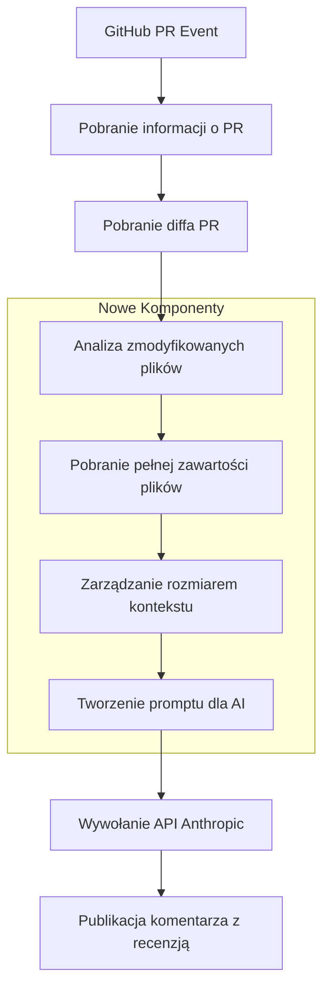

# Plan Implementacji: Rozszerzenie Kontekstu dla AI Pull Request Reviewer

## Przegląd

Celem jest poprawa jakości recenzji kodu dostarczanych przez AI poprzez zapewnienie szerszego kontekstu dla modelu Claude. W szczególności:

- Dodanie do 500 linii oryginalnej wersji każdego modyfikowanego pliku
- Ustawienie twardego limitu tokenów (90% limitu kontekstu Claude'a)
- Priorytetyzacja zawartości diffa w przypadku konieczności skrócenia kontekstu

## Diagram Architektury



## Kroki Implementacji

### 1. Utworzenie Modułu Zarządzania Kontekstem

Utwórz nowy plik `src/context-manager.js` do obsługi:
- Ekstrakcji zmodyfikowanych plików z diffa
- Pobierania oryginalnej zawartości plików
- Zarządzania limitami tokenów
- Optymalizacji kontekstu

```javascript
// context-manager.js
import { getOctokit } from "@actions/github";

// Wyodrębnij pliki zmodyfikowane w diffie
export function extractModifiedFiles(diff) {
  const filePathRegex = /^diff --git a\/(.*?) b\/(.*?)$/gm;
  const modifiedFiles = new Set();
  
  let match;
  while ((match = filePathRegex.exec(diff)) !== null) {
    modifiedFiles.add(match[1]);
  }
  
  return Array.from(modifiedFiles);
}

// Pobierz zawartość pliku z repozytorium GitHub
export async function getFileContent({
  octokit,
  owner,
  repo,
  path,
  ref = 'HEAD',
  maxLines = 500
}) {
  try {
    const response = await octokit.rest.repos.getContent({
      owner,
      repo,
      path,
      ref
    });
    
    // GitHub API zwraca zawartość jako base64
    const content = Buffer.from(response.data.content, 'base64').toString();
    
    // Ogranicz do maxLines, jeśli potrzeba
    const lines = content.split('\n');
    if (lines.length > maxLines) {
      return lines.slice(0, maxLines).join('\n') + 
        `\n\n// Plik skrócony do ${maxLines} linii. Kompletny plik ma ${lines.length} linii.`;
    }
    
    return content;
  } catch (error) {
    console.warn(`Nie można pobrać zawartości pliku ${path}: ${error.message}`);
    return `// Nie można pobrać zawartości pliku: ${error.message}`;
  }
}

// Oszacuj liczbę tokenów (Claude używa ~4 znaków na token)
function estimateTokenCount(text) {
  return Math.ceil(text.length / 4);
}

// Zarządzaj kontekstem, aby pozostać w granicach tokenów
export function optimizeContext({
  diff,
  fileContents,
  modelMaxTokens = 200000,
  safetyFactor = 0.9
}) {
  const tokenLimit = modelMaxTokens * safetyFactor;
  
  // Zawsze uwzględnij diff
  const diffTokens = estimateTokenCount(diff);
  let remainingTokens = tokenLimit - diffTokens;
  
  // Tokeny bazowego promptu (przybliżone)
  const basePromptTokens = 1000;
  remainingTokens -= basePromptTokens;
  
  // Jeśli już przekroczony limit tylko z diffem, zwróć tylko diff
  if (remainingTokens <= 0) {
    console.warn("Sam diff przekracza limit tokenów, brak miejsca na kontekst plików");
    return {
      diff,
      fileContents: {},
      estimatedTokens: diffTokens + basePromptTokens
    };
  }
  
  // Sortuj pliki według rozmiaru (najmniejsze najpierw, aby uwzględnić więcej plików)
  const sortedFiles = Object.entries(fileContents).sort(
    ([, contentA], [, contentB]) => 
      estimateTokenCount(contentA) - estimateTokenCount(contentB)
  );
  
  // Uwzględnij jak najwięcej plików
  const optimizedFileContents = {};
  for (const [path, content] of sortedFiles) {
    const contentTokens = estimateTokenCount(content);
    
    if (contentTokens <= remainingTokens) {
      // Uwzględnij cały plik
      optimizedFileContents[path] = content;
      remainingTokens -= contentTokens;
    } else if (remainingTokens > 500) {
      // Uwzględnij skrócony plik
      const truncatedContent = content.substring(0, remainingTokens * 4);
      optimizedFileContents[path] = truncatedContent + 
        "\n\n// Plik skrócony z powodu ograniczeń tokenów";
      remainingTokens = 0;
      break;
    } else {
      // Pomiń plik, jeśli nie ma wystarczającej liczby tokenów
      console.warn(`Pomijanie pliku ${path} z powodu ograniczeń tokenów`);
      break;
    }
  }
  
  return {
    diff,
    fileContents: optimizedFileContents,
    estimatedTokens: tokenLimit - remainingTokens
  };
}
```

### 2. Aktualizacja Modułu Recenzji Kodu

Zmodyfikuj `src/code-review.js`, aby obsługiwał kontekst plików:

```javascript
import Anthropic from "@anthropic-ai/sdk";
import dotenv from "dotenv";

dotenv.config();

/**
 * Wykonuje recenzję kodu AI dla diffa PR przy użyciu modelu Claude firmy Anthropic
 * @param {string} prDiff Diff PR do recenzji
 * @param {Object} fileContents Mapa ścieżek plików do ich pełnej zawartości
 * @param {string} apiKey Klucz API Anthropic
 * @param {Object} options Dodatkowe opcje
 * @returns {Promise<string>} Informacja zwrotna z recenzji AI
 */
export async function performAICodeReview(prDiff, fileContents = {}, apiKey, options = {}) {
  if (!prDiff) {
    throw new Error("PR diff jest pusty lub nie został dostarczony");
  }

  if (!apiKey) {
    throw new Error("Klucz API Anthropic jest wymagany");
  }

  const { 
    model = "claude-3-5-haiku-20241022", 
    maxTokens = 1000 
  } = options;

  const anthropic = new Anthropic({
    apiKey: apiKey,
  });

  // Utwórz sekcję kontekstu pliku, jeśli jest dostępna
  let fileContextSection = "";
  if (Object.keys(fileContents).length > 0) {
    fileContextSection = `
    <existing_files>
    ${Object.entries(fileContents).map(([path, content]) => `
      <file path="${path}">
      ${content}
      </file>
    `).join("\n")}
    </existing_files>
    `;
  }

  try {
    const response = await anthropic.messages.create({
      model: model,
      max_tokens: maxTokens,
      messages: [{
        role: "user",
        content: `Jesteś doświadczonym inżynierem oprogramowania recenzującym pull request.
        Przeprowadź dokładną recenzję PR na podstawie dostarczonego diffa.
        
        ${fileContextSection}

        <diff>
        ${prDiff}
        </diff>

        Skup się na następujących kwestiach:
        - Czytelność kodu - czy kod jest łatwy do zrozumienia?
        - Wydajność kodu - czy kod jest efektywny?
        - Styl kodu - czy styl kodu jest spójny z istniejącymi plikami?
        - Duplikacja kodu - czy kod jest zduplikowany?
        - Jakość kodu - czy kod jest wysokiej jakości?
        - Spójność - czy nowy kod podąża za wzorcami ustalonymi w istniejących plikach?

        Możesz użyć "N/A" dla przypadków, w których PR nie wprowadza żadnych zmian w danym obszarze.
        
        Odwołując się do wzorców kodu lub stylów z istniejących plików, podaj konkretne przykłady, aby uzasadnić swój feedback.`
      }]
    });

    return response.content[0].text;
  } catch (error) {
    console.error("Błąd podczas recenzji AI:", error);
    throw error;
  }
}
```

### 3. Aktualizacja Głównego Pliku Index

Zmodyfikuj `src/index.js`, aby korzystać z nowych funkcji kontekstowych:

```javascript
import * as core from "@actions/core";
import * as fs from "fs";
import {
  getPRDiff,
  extractPRNumber,
  getRepoInfo,
  commentOnPR,
} from "./github-utils.js";
import { performAICodeReview } from "./code-review.js";
import { 
  extractModifiedFiles, 
  getFileContent, 
  optimizeContext 
} from "./context-manager.js";
import { getOctokit } from "@actions/github";

/**
 * Główna funkcja, która organizuje pobieranie diffa PR i recenzję AI
 */
async function run() {
  try {
    // Pobierz dane wejściowe i kontekst
    const githubToken = process.env.GITHUB_TOKEN;
    const anthropicApiKey = process.env.ANTHROPIC_API_KEY;
    const maxFileLines = parseInt(process.env.MAX_FILE_LINES || "500", 10);
    const modelName = process.env.MODEL_NAME || "claude-3-5-haiku-20241022";
    const safetyFactor = parseFloat(process.env.CONTEXT_SAFETY_FACTOR || "0.9");
    
    // Limity tokenów modelu (przybliżone)
    const MODEL_TOKEN_LIMITS = {
      "claude-3-5-haiku-20241022": 200000,
      "claude-3-5-sonnet-20240620": 200000,
      "claude-3-opus-20240229": 200000
    };
    
    const modelMaxTokens = MODEL_TOKEN_LIMITS[modelName] || 100000;

    if (!githubToken) {
      throw new Error("GITHUB_TOKEN jest wymagany");
    }

    if (!anthropicApiKey) {
      throw new Error("ANTHROPIC_API_KEY jest wymagany");
    }

    // Pobierz szczegóły PR
    const prNumber = extractPRNumber();
    const {owner, repo} = getRepoInfo();

    // Ustaw PR_NUMBER w środowisku dla kroku komentarza
    if (prNumber) {
      console.log(`Numer PR: ${prNumber}`);
    }

    // Pobierz diff PR
    const {diff} = await getPRDiff({
      token: githubToken,
      owner,
      repo,
      prNumber,
    });
    
    // Wyodrębnij zmodyfikowane pliki z diffa
    const modifiedFiles = extractModifiedFiles(diff);
    console.log(`Znaleziono ${modifiedFiles.length} zmodyfikowanych plików w diffie`);
    
    // Zainicjuj Octokit do pobierania plików
    const octokit = getOctokit(githubToken);
    
    // Pobierz zawartość zmodyfikowanych plików
    const fileContentsMap = {};
    
    for (const filePath of modifiedFiles) {
      try {
        // Dla PR, użyj gałęzi bazowej jako referencji, aby pobrać oryginalny plik
        const content = await getFileContent({
          octokit,
          owner,
          repo,
          path: filePath,
          ref: prNumber ? `HEAD~1` : 'HEAD~1', // Pobierz plik przed zmianami
          maxLines: maxFileLines
        });
        
        fileContentsMap[filePath] = content;
        console.log(`Pobrano zawartość dla ${filePath} (${content.length} bajtów)`);
      } catch (error) {
        console.warn(`Błąd podczas pobierania zawartości dla ${filePath}: ${error.message}`);
      }
    }
    
    // Optymalizuj kontekst, aby zmieścić się w limitach tokenów
    const { diff: optimizedDiff, fileContents: optimizedFileContents } = optimizeContext({
      diff,
      fileContents: fileContentsMap,
      modelMaxTokens,
      safetyFactor
    });
    
    console.log(`Zoptymalizowany kontekst z ${Object.keys(optimizedFileContents).length} plikami`);
    
    // Wykonaj recenzję AI z rozszerzonym kontekstem
    const reviewText = await performAICodeReview(
      optimizedDiff, 
      optimizedFileContents, 
      anthropicApiKey,
      { model: modelName }
    );

    // Skomentuj PR z recenzją
    if (prNumber) {
      await commentOnPR({
        token: githubToken,
        owner,
        repo,
        prNumber,
        body: `## Feedback z recenzji AI:\n\n${reviewText}`,
      });
    } else {
      // Zaloguj recenzję, jeśli to nie PR
      console.log("Feedback z recenzji AI:");
      console.log(reviewText);
    }

    console.log("Recenzja AI zakończona pomyślnie");
  } catch (error) {
    core.setFailed(`Akcja nie powiodła się z błędem: ${error.message}`);
    console.error(error);
  }
}

// Uruchom główną funkcję
run();
```

### 4. Aktualizacja Konfiguracji Akcji

Zaktualizuj `action.yml`, aby umożliwić konfigurowanie opcji kontekstu:

```yaml
# action.yml
name: AI Reviewer
description: Comment from AI

# GitHub Marketplace - Branding
branding:
  icon: "terminal"
  color: "black"

# Input parameters
inputs:
  ANTHROPIC_API_KEY:
    description: "Klucz API Anthropic Studio"
  MAX_FILE_LINES:
    description: "Maksymalna liczba linii do uwzględnienia z każdego pliku"
    required: false
    default: "500"
  MODEL_NAME:
    description: "Model Anthropic do użycia"
    required: false
    default: "claude-3-5-haiku-20241022"
  CONTEXT_SAFETY_FACTOR:
    description: "Procent limitu tokenów do użycia (0-1)"
    required: false
    default: "0.9"

# Action steps
runs:
  using: "composite"
  steps:
    - name: Get PR diff, run AI review, and comment
      id: ai-review
      shell: bash
      run: node ${GITHUB_ACTION_PATH}/dist/index.cjs
      env:
        ANTHROPIC_API_KEY: ${{ inputs.ANTHROPIC_API_KEY }}
        GITHUB_TOKEN: ${{ github.token }}
        MAX_FILE_LINES: ${{ inputs.MAX_FILE_LINES }}
        MODEL_NAME: ${{ inputs.MODEL_NAME }}
        CONTEXT_SAFETY_FACTOR: ${{ inputs.CONTEXT_SAFETY_FACTOR }}
```

## Kluczowe Uwagi

1. **Logika Pobierania Plików**: 
   - Pobiera oryginalną zawartość pliku sprzed zmian
   - Ograniczona do konfigurowalnej liczby linii (domyślnie 500)
   - Obsługuje błędy w sposób elegancki, jeśli pliki nie mogą być pobrane

2. **Zarządzanie Tokenami**:
   - Szacuje tokeny przy użyciu przybliżonej liczby znaków (4 znaki ≈ 1 token)
   - Priorytetyzuje zawartość diffa, gdy kontekst musi być skrócony
   - Używa współczynnika bezpieczeństwa, aby pozostać poniżej limitów modelu

3. **Rozszerzony Prompt**:
   - Dostarcza kontekst oryginalnego pliku w ustrukturyzowanym formacie
   - Zachęca model do oceny spójności z istniejącym kodem
   - Prosi o konkretne przykłady przy odwoływaniu się do wzorców

4. **Konfiguracja**:
   - Wszystkie parametry są konfigurowalne za pomocą zmiennych środowiskowych
   - Wartości domyślne można nadpisać w plikach workflow

## Plan Testowania

1. **Testy Jednostkowe**:
   - Testowanie `extractModifiedFiles` z różnymi formatami diffów
   - Testowanie `optimizeContext` z różnymi ograniczeniami tokenów
   - Testowanie logiki skracania plików przekraczających limity linii

2. **Testy Integracyjne**:
   - Tworzenie testowych PR z plikami o różnych rozmiarach i modyfikacjach
   - Weryfikacja, czy poprawna zawartość pliku jest pobierana
   - Sprawdzanie, czy szacowanie tokenów i skracanie działa zgodnie z oczekiwaniami

3. **Testy End-to-End**:
   - Przesyłanie rzeczywistych PR z ulepszoną akcją
   - Weryfikacja, czy recenzje odnoszą się do istniejących wzorców kodu
   - Potwierdzanie, że akcja obsługuje duże PR bez błędów limitu tokenów

## Plan Wdrożenia

1. Utwórz nowy branch `feature/enhanced-context`
2. Zaimplementuj nowe pliki i zmiany
3. Przetestuj lokalnie z różnymi rozmiarami PR
4. Zaktualizuj dokumentację w README.md
5. Utwórz PR i przeprowadź recenzję kodu
6. Po zatwierdzeniu, scal z główną gałęzią i oznacz nową wersję