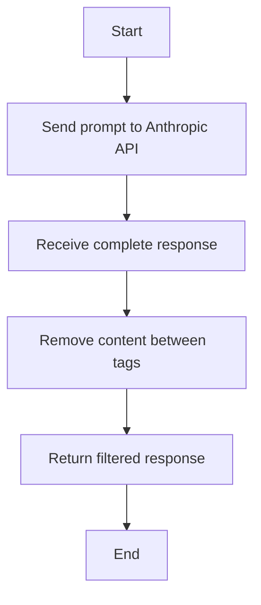

# Code Review Filter Implementation Plan

## Current Process

1. In `performAICodeReview` (src/code-review.js):
   - The function sends a prompt to Anthropic's Claude model
   - The prompt instructs Claude to include its detailed analysis in `<code_review_analysis>` tags
   - The function returns the complete response from Claude, including this analysis section

2. In the main `run` function (src/index.js):
   - The response from `performAICodeReview` is passed directly to `commentOnPR`
   - The comment includes the entire response, including the `<code_review_analysis>` section

## The Problem

The `<code_review_analysis>` section is valuable for the model to organize its thoughts, but it shouldn't be included in the final GitHub comment. This section is only meant as a "thinking" step for the model.

## Solution Plan

Here's the proposed plan to fix this issue:

### 1. Modify the `performAICodeReview` function

We'll add a post-processing step that filters out the `<code_review_analysis>` section from the response before returning it:



### 2. Implementation Details

1. Keep the existing prompt as is, so Claude continues to use the analysis section for its thought process
2. After receiving the response, use a regex pattern to remove everything between `<code_review_analysis>` and `</code_review_analysis>` tags
3. Return only the filtered content

### 3. Code Changes

Here's the specific code change recommended for the `performAICodeReview` function in `src/code-review.js`:

```javascript
// Add this before returning the response.content[0].text
const filteredResponse = response.content[0].text.replace(/<code_review_analysis>[\s\S]*?<\/code_review_analysis>/g, '');
return filteredResponse;
```

This regex pattern will:
- Match the opening tag `<code_review_analysis>`
- Capture all content (including newlines with `[\s\S]*?`) until it finds the closing tag
- Replace the entire matched section with an empty string
- The `?` makes the matching non-greedy to ensure it only captures up to the first closing tag

### Benefits of This Approach

1. **Minimal Changes**: Only requires modifying one function
2. **Preserves Model Thinking**: Claude still performs its analysis in the structured format
3. **Clean Output**: Only the final markdown review is returned and shown in the GitHub comment
4. **No Impact on Other Features**: Doesn't affect any other part of the application